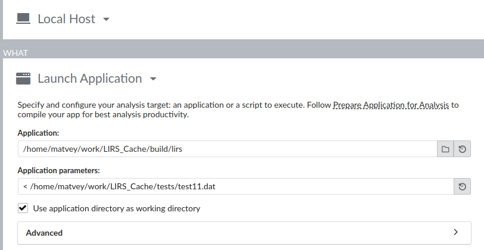
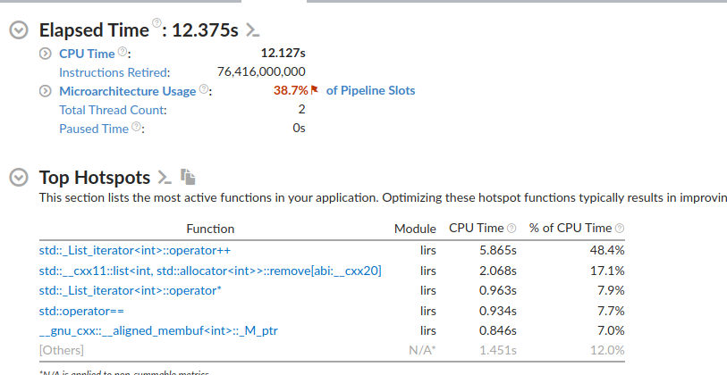
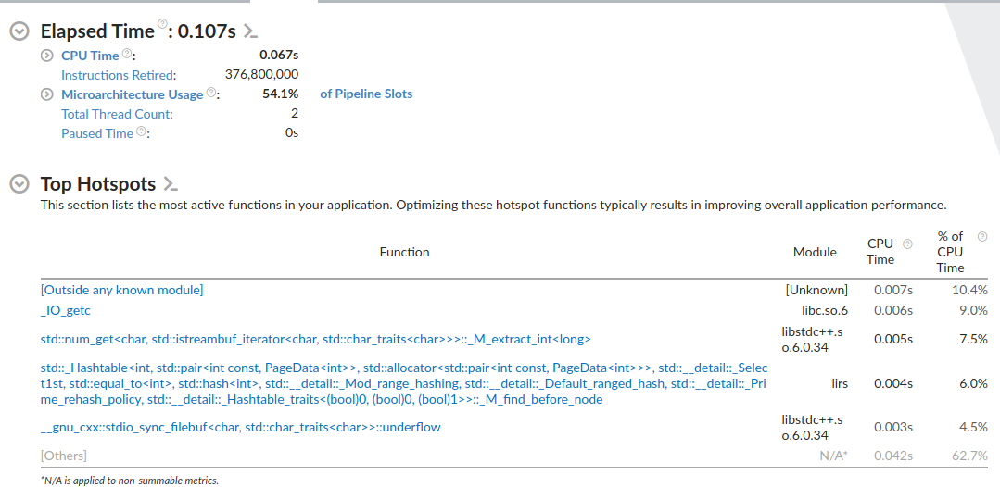

# LIRS Cache

## Algorithm
`LIRS` (Low Inter-Reference Recency Set) — множество с низкой референсной давностью, то есть элементы, которые часто используются.  
`HIRS` (High Inter-Reference Recency Set) — множество с высокой референсной давностью, то есть элементы, которые реже используются в кэше.  
<table>
    <tr>
        <td></td>
        <td></td>
    </tr>
</table>

## Performance
Сравнение с "идеальным" (но в реальности неосуществимым) OPT (Optimal Page Replacemen) кэшем.


## Оптимизация
Заходим в `Intel VTune Profiler`  


Изначально на большой тест [test11.dat](tests/test11.dat) имеем:


Было принято избавиться от std::list::remove, будем дополнительно хранить информацию о итераторе данной
 страницы, то есть к lirs или hirs принадлежит данная страница и место, где она там хранится.  

Меняем

```cpp
std::unordered_map<int, std::pair<valType, pageKey_t>> cache_;
```

на такую конструкцию:

```cpp
std::unordered_map<int, PageData<valType>> cache_;
```

PageData_t:

```cpp
template <typename valType>
struct PageData_t
{
    valType value_;
    pageKey_t type_;
    typename std::list<int>::iterator listIter_;
};
```

Имеем:
