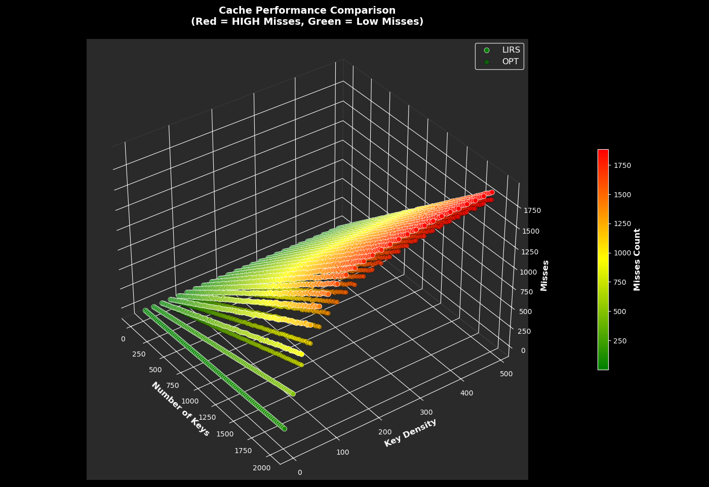

# LIRS Cache

## Algorithm
`LIRS` (Low Inter-Reference Recency Set) — множество с низкой референсной давностью, то есть элементы, которые часто используются.  
`HIRS` (High Inter-Reference Recency Set) — множество с высокой референсной давностью, то есть элементы, которые реже используются в кэше.  
<table>
    <tr>
        <td></td>
        <td></td>
    </tr>
</table>

## Performance
